<head>
    
    
</head>

# 摘要U
# 引言I
数学应用题（Math Word Problem ，MWP）自动求解器的探索与优化始终是人工智能研究中一个极具实际意义的探索方向。该领域研究的主要目的在于结合人工智能技术，设计出一套能够自动完成数学应用题的理解，求解和答案输出的系统。

数学应用题是学生在基础教育阶段需要学习的一项重要内容，其对于学生理性思维、推理能力以及探索欲的养成有着至关重要的作用。然而，针对数学应用题的教育正面临着以下一些困难：
### 依赖辅导者的能力
拥有良好教育背景的家长只是少数，学生在向家长寻求帮助时时常会出现超出家长能力范围的情况，无法得到解答、甚至得到错误的解答，严重挫伤学生的学习积极性。
### 及时性差
然而由于传统的教育模式中获得反馈已经要到几天以后，漫长的等待对于提升学习能力和培养学习兴趣都是相当大的不利因素
### 一名老师对应多名学生
教师资源相当宝贵，一名老师要应对数十名学生，并不能在每一个学生身上分出足够的精力。
在这样的背景下，如果能够搭建起可以自动求解数学应用题的机器，那么将会可以有效地解决前面提到的三个问题：数学应用题自动求解器可以及时地、一对一地向学生给出数学应用题的解答，且不依赖于家长的知识水平，故而对于基础阶段的教育有着相当重大的意义。

# 相关工作U
数学应用题自动求解（Bobrow, 1964; Briars and Larkin, 1984; Fletcher, 1985; Bakman, 2007; Yuhui et al., 2010）是自然语言处理领域一个极具实际应用价值的领域。2008 年之前的方法大多是基于规则建构。它们的输入通常是限制严格的、格式标准的句子，然后通过模式匹配将它们映射到数学语言中。 Mukherjee与Garain (2008)对这种方法做了很好的描述，由于近年来主流方法发生巨大的变迁，模式匹配方法并不是我们关注的重点。

符号和统计方法后来逐渐兴起，此类解决方法将数学单词问题转换为结构化表示。 Bakman (2007) 将通过预定义模式将文本映射到等式。 Liguda and Pfeiffer (2012) 使用增强语义网络来表示数学问题。Shi(2015) 使用其预定义的语义系统来转换文本。然而这种方法的泛化性能很差。后来基于模板的方法得到了进一步的发展，Hossein（2014）建构了根据动词判断模板并提取数字插入插槽的方法。Kushman（2014）和Zhou（2015）先后提出和改进了寻找模板并且将数字和未知数填入可变槽和数字槽问题的方法。Roy 和 Roth (2015) 提出了把文本映射为方程树然后选择最大可能性的生成树的方法。

在Math23K,Dolphin,MAWPS（Wang,2017)(Huang,2016)(Wang,2019)等几个大规模的数学应用题数据集被提出后，基于大规模数据集的深度学习方法逐渐崭露头角。

Wang（2018）提出了方程归一化方法缩减可能的生成空间，为生成表达式提供了便利。Wang（2019）通过树来预测MWP的表达式的模型，并且通过一些特殊处理来为问题的目标空间降维。随着Ape210K这一最大的数据集被赵 (2020)提出，数学应用题的处理有着光明的发展前景。我们基于Shifeng Huang(2021)所提出的一种类比相似题的方法来设计和改进数学应用题求解器。
# 背景知识F
## Transformer简介F
Transformer架构是谷歌提出的用于处理序列相关问题的架构，其基于注意力机制设计，在大量的NLP任务中获得了显著的成功，在包含阅读理解、机器翻译、文本分类等各方面都取得了突破，因而成为了自然语言处理中的一大基本方法。值得注意的是，由于其没有采用传统的RNN结构，因此在处理序列时消去了时间依赖性，为大规模的并行处理提供了理论上的条件，因此在处理复杂的自然语言任务时具备独到的优越性。

Transformer的关键在于其独特的多头自注意力机制，

从输入和输出上来讲，Transformer也是一种seq2seq模型，因此他也被分解为编码器-解码器两部分。如图所示，transformer的编码器部分输入是包含了符号意义嵌入和位置嵌入两部分的词嵌入向量序列，编码器的输出将被保存以作为解码器的初始输入。而解码器的输出将会通过线性层和softmax层后形成概率分布用于预测输出符号。
其编码器部分由数个编码器模块构成，每个编码器模块都由多头自注意力层和前馈神经网络构成，并且通过加入残差联接来使得搭建更深的神经网络成为可能，此外，在层与层之间还加入了归一化层进行标准处理。
其解码器部分同样由数个解码器模块组成，每一个解码器模块由一层多头自注意力、一层交叉注意力和一层前馈神经网络组成。交叉注意力的特性是其$Q$矩阵来自于上一层解码器的输出矩阵，而$K$、$V$矩阵来自于编码器的对应深度模块，从而实现了跨越网络主体对输入进行查询提高了输出与输入的强关联性。与编码器模块类似，解码器模块在层与层之间同样加入了残差联接和归一化层。

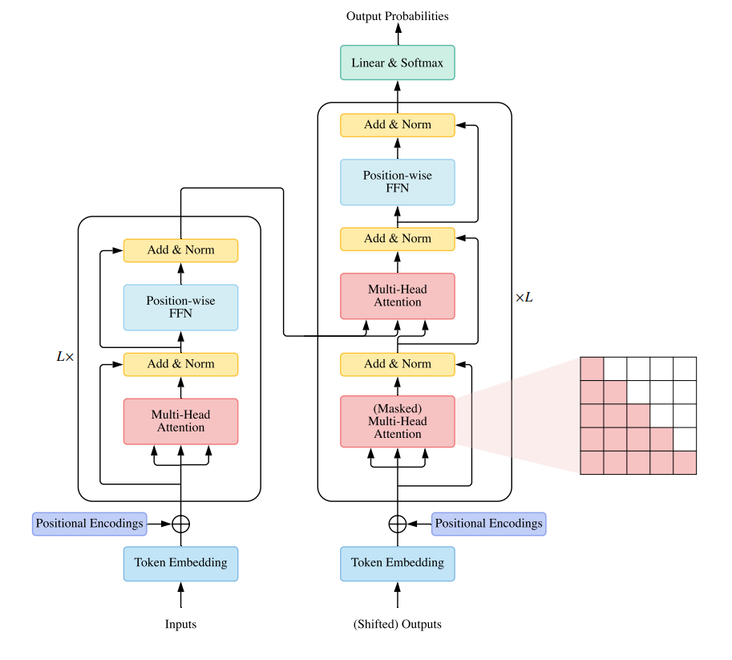
## uniLM简介F
UniLM(Unified Language Model)，即统一预训练模型。UniLM是基于BERT提出的新型自然语言处理和生成架构，同BERT一样，也由数个Transformer编码器块构成，但是其相对初始的Tranformer编码器做了掩码方面的改进以适应不同的应用场景。其相对于BERT的最大不同在于UniLM不仅仅可以用于自然语言理解的任务，也可以完成自然语言生成的任务。
其基本原理如公式所示，UniLM框架对Transformer编码器作了如下的修改。特定任务要求的特定信息流向将会决定其掩码矩阵M，若指定的信息流动被允许则掩码矩阵中的矩阵元被设计为0，若指定的信息流动被禁止则掩码矩阵中的矩阵元被设计为$-\infty$。这一矩阵随后被叠加到自注意力机制的注意力矩阵上，实现了对特定信息流向的屏蔽。基于其架构的设计特点，它在单向、双向和序列到序列任务中都有很好的表现，使得利用现成的BERT模型较好地完成生成任务成为了可能。

$M_{ij}=\left\{
                \begin{array}{ll}
                  0 & , & \text{允许信息流动}\\
                  -\infty & , & \text{禁止信息流动}
                \end{array}
              \right.$

$A_l=softmax(\frac{QK^T}{\sqrt{d_k}}+M)$

## 词嵌入简介F
词嵌入指的是将自然语言中的单个词汇投射为一个多维向量，而该向量中包含了该词汇的语义信息。例如在完成词嵌入之后，词性的转换过程应当有着类似的向量，含义相似的词语应当在向量空间中具备着非常靠近的位置。如下图所示：

作为自然语言处理领域的基本方法，词嵌入方法多样，发展迅速。
## 数学应用题自动求解简介F
我们可以发现，MWP自动求解器大致可以分为基于以下几种方法构建：

1. 规则与匹配：基于人工工程和设定好的规则来求解问题
1. 统计方法：通过统计被标记好的文本中前后文关系来训练模型，然后使用前后文关系来推测问题中所需使用的数字、运算符和数字顺序
1. 深度学习方法：将深度学习方法应用于解决数学应用题，因此获得了不需要人工干预即可获得有效的特征表示的特点。

# 数据获取与处理F
## 数据集F
MATH23K数据集是一个包含大量小学生水平数学应用题与答案的中文数据集，总共包含23161道题目及其答案。其数据源自于中国的数个线上教育网站，在从网络上爬取繁杂的题目相关信息后，作者又通过基于规则的方法完成了结构化的{题目，表达式，答案}信息的处理，最后又将不符合要求的问题删除，形成了目前被最广泛使用的中文数据集MATH23K。在我们的任务中，按照4:1的比例对数据集进行划分。MATH23K中的18529道题目被划分为训练集，4632道题目被划分为测试集。
## 预处理F
在求解小学应用题时，如果题干描述不变而只是改变其中的数值，那么对应的表达式结构也应当保持不变而只是改变数值。为了实现解题方法与具体数值的无关性，在处理题目文本和答案文本时，我们将其中的数字分离出来，并且将它们替换为如同‘x’一样的符号，在获得以符号指代的答案表达式之后，再将未知数符号换回数字。
除此之外，为了使得表达式更为规范以有利于机器学习，可以通过一些基于规则的方法识别出题目和等式中的带分数和百分数，并且将它们转换为标准的单一的数字或者分数。
## 前缀表达式F
前缀表达式是一种特殊的数学运算记录方法。我们通常所使用的中缀表达式中，运算符被放在两个操作数之间。而在前缀表达式中，我们将运算符写在前边，而将操作数写在运算符之后。下图给出了同样的数学运算在前缀表达式和中缀表达式中的不同书写方法。

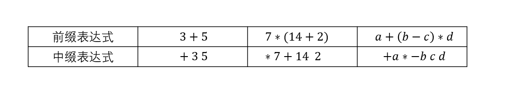

前缀表达式具有不需要明确运算符优先级即可按指定顺序完成定义明确的运算的特性，这赋予了前缀表达式两大优势。一是其不包括括号，所以缩短了表达式的长度同时又减少了表达式中可能出现的符号种类，这对于提高生成任务的准确率而言非常重要；另一方面，其生成的表达式只需要通过简单的出栈入栈即可完成运算，而不涉及运算符优先级的判别，故而对于在对表达式字符串进行计算以获得结果的环节中也具备优势。

故而在我们的生成系统内部实际选择了使用前缀表达式，达到提高生成准确度的目的。为了实现与人类的交互，系统在对外接口时需要与易于人类理解的中缀表达式进行转换，故而我们在预处理时即将数据集的中缀表达式转换为前缀表达式方便机器学习，而在机器生成前缀形式的答案表达式之后又将其转换为中缀表达式输出，以让不具备专业知识的使用者理解。

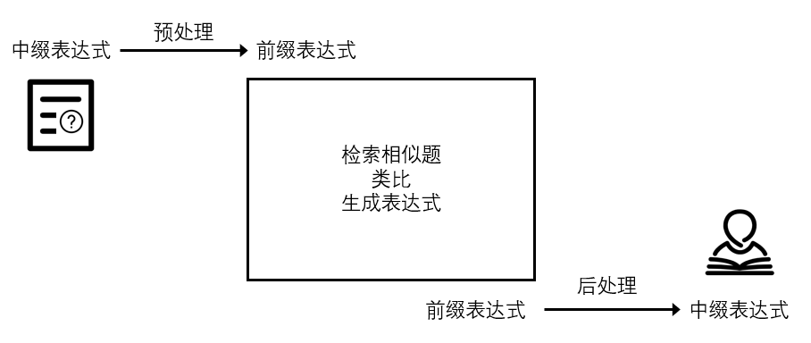

## 数据增强F
与常规的自然语言处理任务不同，数学题目的求解应当具备对于情景的独立性。即在问题中出现的实体名称只是为了便于学生理解而不涉及解题方法。（真正影响到解题方法的应当是题目中更具动作性的描述）为了让机器能够忽略掉题目中特定实体的影响，更加关注题目中涉及逻辑的那些更为本质的部分，我们设计通过简单的实体替换来完成这一目标。
我们通过自编写和搜狗词库下载两种途径搜集了多个同类词词库，每个词库中都包含某类词语，例如“水果”、“人名”或者“交通工具”等。在利用结巴进行分词后，我们会对题目用词进行检索，如果匹配到了某个词库中的词语，便会以一定概率在该题库中随机抽取一个同类词对原词进行替换，以获得一道情景不同但是逻辑完全相同的题目。由于部分题目可以获得大量的扩增，而对于不包含词库中词语的题目，扩增则完全无法进行。为了防止题库变得过于不平衡，我们限制1道原题题目最多能被扩增为6道题目。
通过这种方法我们将用于训练的18529扩增为47471道题目，扩增比例为256%

# 相似性方法进行类比推理F
## 利用题目向量寻找相似题F
在完成了数据预处理后，我们已经获得了以token列表形式表示的题目和答案。我们需要为一道给定的待求解题目$I_0$找到它的相似题$I_i$，这一过程可以分为两步进行，首先利用word2vec或transformer等方法获得题目向量，然后对比题目向量，找到其中与待求解题目题目向量相似度最高的，并把对应的题目作为检索到的相似题。
### 获取题目向量F
在此步骤中我们需要根据题目获得一个能够代表整道题目的向量。考虑到在搜索相似题时待求解题目的答案信息尚不存在，所以我们将会使用问题的相似度来表征答案的相似度。可以使用的方法包括word2vec，Bert_as_service，transformer等，我们尝试了使用word2vec方法和transformers方法来进行题目向量的生成。

#### 利用word2vec获取题目向量F
这一获取题目向量的方法可以分为两步进行，第一步是通过word2vec方法进行词嵌入，首先我们获取了一个经过大量自然语言数据训练过的词表，该词表由字典形式的键-值对构成，键即为自然语言中的词（对于中文来说就是字），值则是映射到多维空间中的向量。我们将以问题中的每一个字作为键到该词表中查询其对应的值，如此便获得了问题中单词列表转化而来的向量列表，其中每一个向量都表征着其自然语言意义。
#### 利用SBERT获取题目向量F

SBERT是一种延续Transformer编码器架构，采用特殊方法训练以特化性适应句向量生成的BERT模型，我们使用它作为transformers的代表来获取题目向量。

利用SBERT来获取词向量与通过word2vec来获取词向量本质上都是在进行词嵌入，但是二者在过程，结果以及特性上都有所不同。与word2vec的词嵌入直接查找现成词语-向量表不同，SBERT获得预训练好的固定语义向量之后还会将整个句子作为输入序列进行处理，在其多头注意力机制的作用下，代表每个词语的词向量将会受到句子中其他词语的影响，并且计算出新的包含了句中其他词语信息的词向量。这样获得的词向量是结合了上下文语境的，更能贴合其在自然语言汇中的实际语义，而word2vec获得的固定词向量则与具体语境无关，因此在面对一词多义、指代等方面表现得远不如通过SBERT获得的词向量。
### 检索相似题U
类似于获取题库中备选题目的题目向量的过程，将待求解题目也作由文本向题目向量的转化，然后对备选题目向量作内积，内积越大则意味着它们的向量夹角余弦越大，也就意味着两道题目的相似度越高。选取其中具有最大值的备选题目作为相似题，与备选题目一起送入后续处理过程。
## 题目token级别向量的生成与处理F
### 基于BERT的token获取F
我们采用UniLM框架来建构和题目和答案中每个符号对应的向量表示。由于UniLM框架是基于BERT搭建并且对于BERT有非常好的兼容性，我们可以直接使用预训练好的BERT-base-Chinese模型，因此继承了BERT预训练模型的优点，又弥补了BERT不适应于生成任务的缺点。
在这一环节，我们会将待求解题目和相似题目分别处理。待求解题目的答案部分直接以空白语义进行填充后，每道题目都将包含题目和解答两部分，再通过BERT进行嵌入，由自然语言转换为向量后，对于每道题目我们都将会获得两个个向量组，分别代表题目和解答的信息。但值得注意的是，此时待求解题解答向量中真正蕴含的关于答案的信息尚且非常少，并不能直接根据其获取答案。
### 掩码矩阵控制信息流向F
由于我们的数学应用题求解任务要根据问题生成答案，是序列到序列任务，即需要理解又需要生成，同时又需要在大量的自然语言预训练基础上完成，所以选择了uniLM作为基本框架。
在常规的BERT模型中，注意力可以被分散到序列中的任意一处。作为一种seq2seq任务，我们具体的问题情境并不满足这一条件。第一，我们需要根据题干（序列Q）来生成表达式（序列A），在这一过程中信息应当是单向地由题干流向表达式；第二，在生成的答案表达式某一符号的过程中，可以知晓已经生成的表达式的信息，而无法获得未来将要生成的符号的信息。以上两点要求我们修改注意力可以散布到每一处这一特性，而这可以通过修改注意力机制中权重的生成方式来实现。我们将不可能的信息传递方向对应的注意力的权重加上一个绝对值极大的负数，这样一来，在通过了softmax层后，该注意力的权重将趋近于0，从而实现了屏蔽不可能方向上的信息流动。

具体到我们的问题情境中，我们将会把从答案到题干的信息流屏蔽，并且把从答案中偏后符号到较前符号的信息流屏蔽，因此我们设计出如图所示的掩码矩阵，借助与uniLM架构整合到我们的框架中，实现对注意力分布区域的限制。

## 类比F
为了使得我们检索到的相似题信息能够汇入到待求解题目之中，我们需要对从上一步得到的各token向量进行进一步的处理。此环节中我们继续使用类似于？中使用的UniLM框架和掩码矩阵，但是不再将相似题和待求解题目分开处理，而是将二者放在一起以实现信息的交汇。
相应地，我们需要重新设计掩码矩阵。如图所示，关于信息流向，我们有如下如下几条原则：

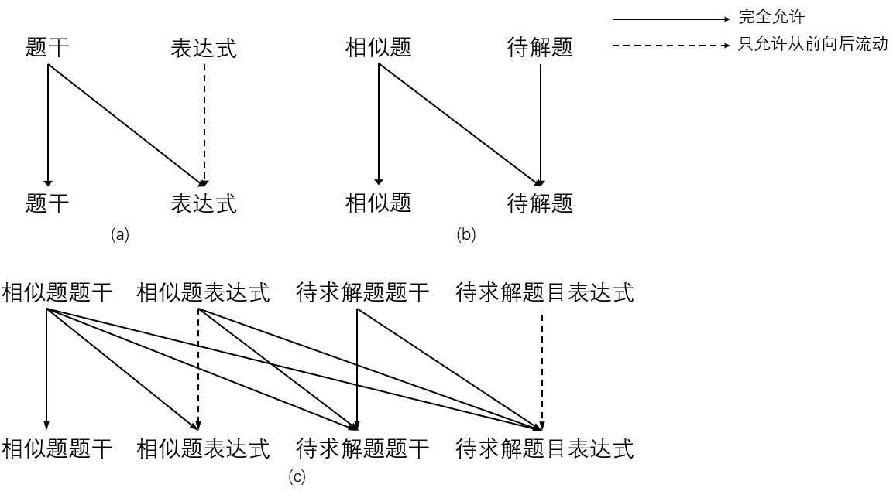

1. 信息由相似题单向流动到待求解题目。我们的目标是借鉴相似题的求解方法并运用到待求解题目之中，待求解题目中的内容不应该反向流动到待相似题之中
2. 在同一道题目内部，信息由问题文本单向流动到答案。单一题目中问题文本是建构答案的依据，由答案向问题的信息流向是违背因果关系，因此不被允许。
3. 在同一问题文本内部，各符号的信息是可以双向流动的。即问题文本前后的信息被允许双向流动。
4. 在同一表达式内部，信息只能从前向后单向流动。由于表达式生成过程中，前面的符号会作为后面符号的生成依据，因此从后向前的信息流向是违背因果关系的。

根据以上原则，我们最终构建出如图所示的掩码矩阵：
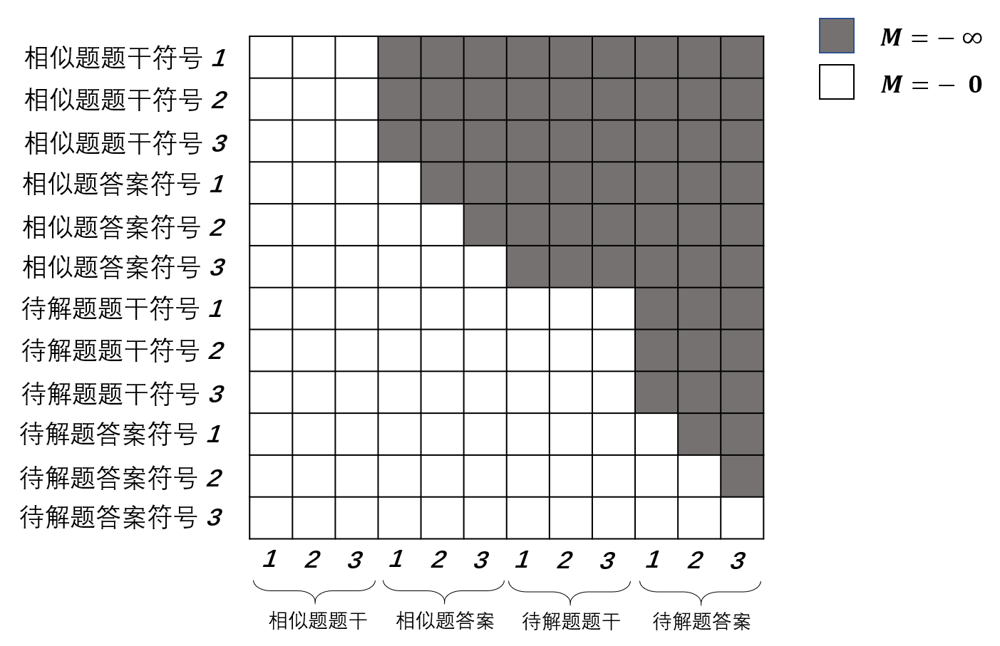
在利用UniLM框架并且使用以上掩码矩阵之后，可以认为待解题答案对应的向量表示中已经包含了足够的关于答案的信息。

## 生成表达式F
### 通过向量生成概率分布F
生成表达式的过程可以被拆分为循环的生成单一表达式符号的子过程，这里的“符号”指的是数学语言中的符号，可以是四则运算符也可以是某个数字。在每一个子过程中，我们将会基于上一步得到的向量表达来预测该符号到底是什么。数个子过程输出的符号串接起来即成为了系统预测的答案表达式。

分析数学表达式可以发现，我们要生成的符号可以被分为两类：一类是固定的符号，如“+”、“-”、“*”和“/”，无论题目如何，这些符号都有出现在表达式中的可能，它们是普适性的，可以作为固定词表出现。另一类是不固定的符号，即题目中给出的数值，表达式中出现的绝大多数取决于问题中给出的数值，故而它们是变化的，通过固定词表查询不具备可行性。
故而我们把数学表达式的生成过程分成两个并行的部分。其中一个部分采用固定词表的机制，另一个部分采用不固定词表的复制机制。两个部分各自产生一个概率分布之后再按权重叠加起来。值得注意的是，从题干中取数的需求并不是所有时刻都同样强烈，所以该权重是由参数向量与表达式向量计算得到的，而该参数向量是需要学习的。
### 固定词表生成F
如图所示，固定词表生成功能的基本实现元件是一层前馈神经网络，用于对符号的向量表示进行运算得到它成为某一特定符号的概率分布。其中可能性最大的一个符号将会成为系统预测的下一个符号。

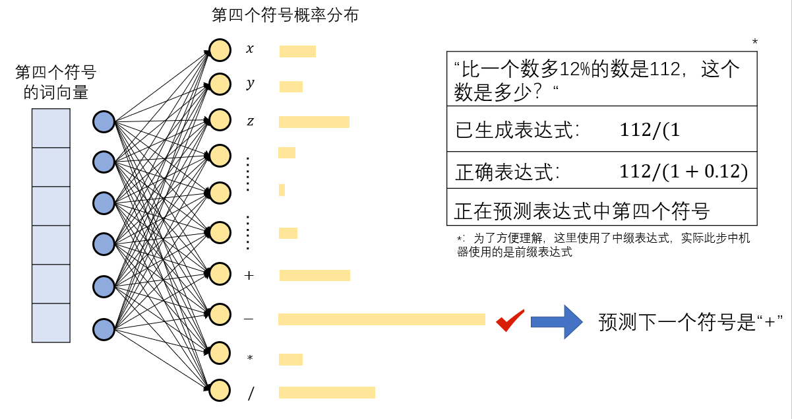

固定词表机制生成的主要内容包括四则运算符号和一些常识性数字（例如题干中给出“两个”时答案中可能会出现“2”）的生成。
### 可变词表问题I
#### 指针神经网络介绍F
指针神经网络（PGN,Pointer Generator Network）是一种用于预测输出序列的概率分布神经网络架构，基于Transformer修改得来。传统的Transformer块在解码环节中把编码器隐藏状态按注意力机制确定权重混合进输出向量中，然后使用输出向量去预测输出词语。而指针神经网络则针对这一过程作了简化：它跳过了按注意力所得权重将编码器隐藏状态混合进输出向量这一步，而是直接使用计算所得的权重去预测输出词语。

$u^i_j=v^Ttanh(W_1e_j+W_2d_i)$

$P(C_i)=softmax(u^i)$

如公式所示，计算由解码器位置i指向编码器位置j的指针强度$u^i_j$，$u^i_j$意味着输出序列中j位置与输入序列i处元素的相关性大小。然后对同一个序列$u^i=(u^i_1,u^i_2,\text(……),u^i_n)$作柔性最大传递函数后即得输出序列中j位置与输入序列i处元素的概率。

指针神经网络的提出主要是为了解决输出序列中可能元素种类随着输入序列变化的问题。在经典的Transformer架构中，输出词表应该是固定的这样才能基于解码器输出向量作多分类计算。而如果可能的元素种类数量会随着输入序列变化，这样的机制就不再适用。而指针神经网络从输入序列中选择可能的元素，绕过了查询固定词表的过程，故而适合于处理可能输出元素种类变化的任务。
#### 实现可变词表F
可以使用指针神经网络来解决数学表达式生成过程中符号种类变化的问题。我们只需要把题干中的数字提取出来并且作为指针可以指向的对象即可。
将通过两个UniLM架构后得到的待求解问题答案中第t个符号对应的向量记为$A_{pt}$，将待求解问题题干中数值符号对应的向量序列记为$Q_{p}=(Q_{p1},Q_{p2},…,Q_{pj},…,Q_{p3})$，则可以通过以下公式计算得出在答案案表达式中t位置出现题干中第j个数值的可能性。

$P(C^{A_p}_t=C^{Q_p}_j)=\frac{v^Ttanh(W_1Q_{pj}+W_2A_{pt})}{\sum_{m}^{}v^Ttanh(W_1Q_{pm}+W_2A_{pt})}$

由可变词表生成的主要内容是题干中给出的数值符号。

## 损失函数
我们在训练过程中所使用的损失函数由两部分构成，主要部分表示正确生成待求解题目答案的概率的负对数。生成正确答案的概率由正确生成答案表达式中每一个符号的概率连乘获得。辅助部分意味着正确求解相似题答案概率的负对数，根据本架构的特征，在处理待求解题目的过程中并不需要花出太多额外的算力求解相似题，故而使用辅助损失函数加速训练。

$L=L_{main}+L_{sup}$

$L_{main}=\prod_{i} P(C^{A_p}_t=C^{A_p}_{t\text(right)};C^{A_p}_1,C^{A_p}_2,…,C^{A_p}_{t-1},Q_p,A_s,Q_s)$

$L_{sup}=\prod_{i} P(C^{A_s}_t=C^{A_s}_{t\text(right)};C^{A_s}_1,C^{A_s}_2,…,C^{A_s}_{t-1},Q_s)$

# 实验结果U
## 基线方法
## 我的结果
### SBERT/word2vec模型U
如图所示，我们分别使用Word2Vec或者SBERT作为检索模块进行相似题检索器，并进行相互独立的训练和测试时。

#### 效果增强
在训练过程中，SBERT作为相似题搜索器时表现出的性能优于Word2Vec。
##### 收敛加快，loss下限降低（normal/sim_0-80:loss曲线）

为了让Loss的变化更清晰，我们对Loss作了对数变换，以在$Loss<<1$时仍能较好地显示其变化情况。可以看到在训练过程中，当$Batch<=20$时，两种方式进行相似题搜索并未表现出明显的性能差距，二者损失函数的降低速度相当，同时取得的准确率也无呈现出稳定区别。而从训练的中期开始，SBERT作为相似题搜索器表现出了相对于Word2Vec的优势，其损失函数更快地趋向于收敛。在两种方法都达到收敛之后，SBERT所取得的最终综合准确率高于W2V约0.5%，故而我们认为将相似题搜索器由W2V替换为SBERT可以取得一定的性能优化。

基于SBERT和Word2Vec的原理进行分析，我们认为SBERT结合语境计算词向量的方法可以更精确地反映词语的语义，比起Word2Vec固定词向量的方式取得了更契合问题特性的词向量，故而在后续的句向量相似度计算时能够实现更高的精确度，为待求解题匹配了更恰当的相似题，从而最终将优势传导到了测试时所展现的准确度提升上。

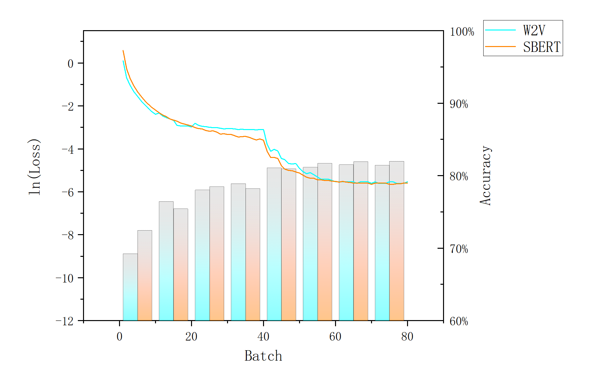
##### 最终效果变好，acc增大，尤其是难题的acc增大（normal_75/sim_80:2*acc表格）

值得注意的是，我们按照以6字符为界限根据问题答案长度对问题进行二分类，并分别统计了两种方法收敛后的分类准确率如表格。可以发现SBERT所取得的模型在处理难题时取得了约2%的提升，而在处理相对较容易的问题时面对Word2Vec并不具备优势。SBERT模型相对于Word2Vec模型在综合准确率上的提升也完全来自于其处理相对较难的题目的能力有所提升。

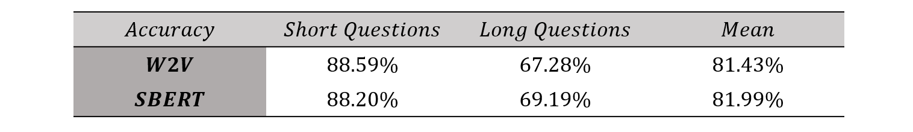

表达式较长的题目意味着该题目内部蕴含着更为复杂的逻辑关系，所以其题干文本的表达也会相对复杂。而在处理相对复杂、词语之间关系更为重要的问题时，重视语境的SBERT能够更好地捕捉到词语之间的联系，使得文本之间的关系信息在生成句向量发挥作用。因此越是复杂的问题，使用SBERT作为相似题搜索器时相对Word2Vec的优势就越明显。
### 数据增强/数据不增强U
小学老师在教育时注重举一反三，要求学生面对相同类型的题目时能够触类旁通，学会使用相同的方法来处理。为了让体系更多地习得触及旁通的特性，学会在面对“换汤不换药”的题目时使用相同的解法，我们将进行同义词替换数据增强后的广义数据集与原始数据集分别进行训练和测试，获得了如图片结果。

在进行是否进行数据增广的效果对比时，我们在后续环节选择了表现相对较好的SBERT，统一在该机制下进行相似题检索和推理生成。

#### 在同一轮次下有所提升，loss优化，acc增大(enhance/sim_0-30:loss曲线)
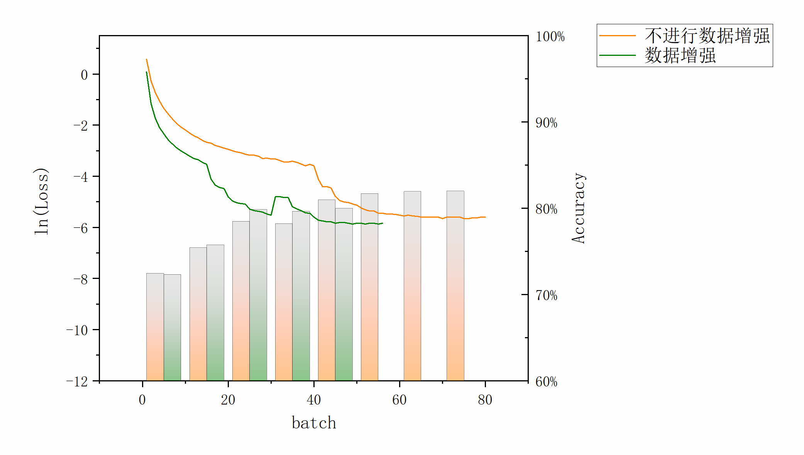

如图片所示，我们可以发现进行数据增广后的训练效果产生了两点重要的变化：一是其收敛速度显著加快，数据增广后的数据集在$Batch = 40$时间就能达到收敛，而如果不进行数据增广，则需要在约$Batch = 65$才能达到收敛。而在达到收敛之前（$Batch \leq 30$）,比较同一训练轮次下的测试结果，可以发现数据增广后的测试效果显著高于不进行数据增广的同期增广效果。在$Batch = 25$时两者的准确率差值极大，达到约1.4%。

#### 学习上限不佳，收敛后的acc降低（enhance_50/sim_80:acc对比）
但是数据增广后的学习最终效果不佳。如图片所示，我们取已经达到收敛之后一段时间的模型（对于数据增广是$Batch=45$的模型，对于无数据增广而言是$Batch=75$的模型），并对它们的解题能力进行测试，发现数据增广后模型的最终解题准确率约为79.98%，低于不进行数据增广的模型约2.01%。

结合我们所采取的数据增广方式来分析，数据增广后模型学习最终学习能力反而下降的原因可能是数据的平衡性下降问题所导致的。由于我们对原始数据集进行同一实体替换的过程中，部分题目产生了较多的子题目而部分题目则产生较少甚至没有产生。这一定程度上导致了训练题库类型与测试题库类型的不平衡。

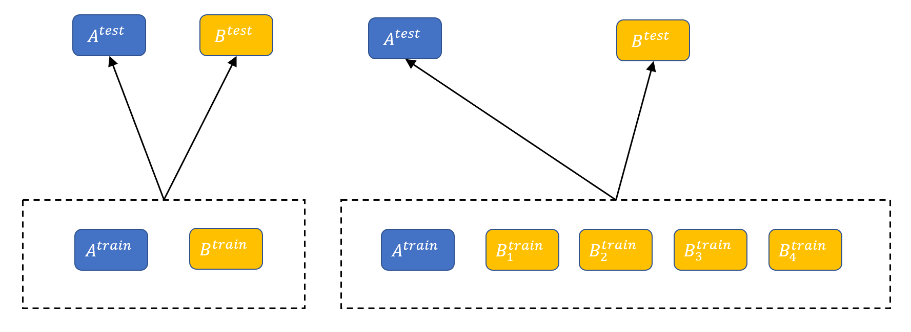

如图所示，以A，B两种类型的题目为例，A题目没有获得增广，而B题目获得了广泛的增广。此时数据集更偏向B类型的题目而测试集并没有发生变化。我们训练所获模型也会更特化于求解B类型题目，其求解B类型题目的能力将会获得优化，但是由于模型训练时以更多地答对训练集中的题目中的题目为目标，这会导致正确解答A类题目能力在训练目标中的权重下降，也就导致了模型解答A类题目的能力降低。最终在数据平衡性较好的测试集上测试解题能力时，解答A类题目（即那些没有被增广的题目类型）的能力偏弱可能会降低最终的综合准确率。

### 最佳结果U（sim_80:4*acc表格）
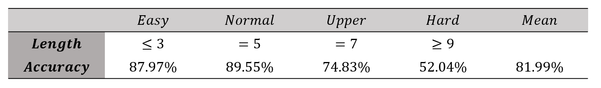
进行数据增广的做法可以取得更快的收敛速度但是效果上限不佳，所以最终我们选取了以SBERT作为相似题搜索器，不进行数据增广的模型作为效果最佳的数学应用题自动求解器。其处理不同难度的题目的准确率如图所示，最终能达到81.99%的综合准确率。
# 结论与展望

# 参考文献
+ Singh S, Mahmood A. The NLP cookbook: Modern recipes for transformer based deep learning architectures[J]. IEEE Access, 2021, 9: 68675-68702.
+ Wang X, Ren J, Lin S, et al. A unified approach to interpreting and boosting adversarial transferability[J]. arXiv preprint arXiv:2010.04055, 2020.
+ Chen J, Tang J, Qin J, et al. GeoQA: A geometric question answering benchmark towards multimodal numerical reasoning[J]. arXiv preprint arXiv:2105.14517, 2021.
+ Ruder S. An overview of multi-task learning in deep neural networks[J]. arXiv preprint arXiv:1706.05098, 2017.
+ Lin T, Wang Y, Liu X, et al. A survey of transformers[J]. arXiv preprint arXiv:2106.04554, 2021.
+ Wolf T, Debut L, Sanh V, et al. Transformers: State-of-the-art natural language processing[C]//Proceedings of the 2020 conference on empirical methods in natural language processing: system demonstrations. 2020: 38-45.
+ Popel M, Bojar O. Training tips for the transformer model[J]. arXiv preprint arXiv:1804.00247, 2018.
+ Liu Y, Ott M, Goyal N, et al. Roberta: A robustly optimized bert pretraining approach[J]. arXiv preprint arXiv:1907.11692, 2019.
+ Radford A, Narasimhan K, Salimans T, et al. Improving language understanding by generative pre-training[J]. 2018.
+ Kenton J D M W C, Toutanova L K. Bert: Pre-training of deep bidirectional transformers for language understanding[C]//Proceedings of NAACL-HLT. 2019: 4171-4186.
+ Vaswani A, Shazeer N, Parmar N, et al. Attention is all you need[J]. Advances in neural information processing systems, 2017, 30.
+ Lan Y, Wang L, Zhang Q, et al. MWPToolkit: An Open-Source Framework for Deep Learning-Based Math Word Problem Solvers[J]. arXiv preprint arXiv:2109.00799, 2021.
+ Huang S, Wang J, Xu J, et al. Recall and Learn: A Memory-augmented Solver for Math Word Problems[C]//Findings of the Association for Computational Linguistics: EMNLP 2021. 2021: 786-796.
+ Huang D, Shi S, Lin C Y, et al. Learning fine-grained expressions to solve math word problems[C]//Proceedings of the 2017 Conference on Empirical Methods in Natural Language Processing. 2017: 805-814.
+ Zhang D, Wang L, Zhang L, et al. The Gap of Semantic Parsing: A Survey on Automatic Math Word Problem Solvers[J]. IEEE transactions on pattern analysis and machine intelligence, 2020, 42(9): 2287-2305.
+ Wang Y, Liu X, Shi S. Deep neural solver for math word problems[C]//Proceedings of the 2017 Conference on Empirical Methods in Natural Language Processing. 2017: 845-854.
+ Roy S, Roth D. Solving general arithmetic word problems[C]//Conference on Empirical Methods in Natural Language Processing, EMNLP 2015. Association for Computational Linguistics (ACL), 2015: 1743-1752.
+ Zhou L, Dai S, Chen L. Learn to solve algebra word problems using quadratic programming[C]//Proceedings of the 2015 Conference on Empirical Methods in Natural Language Processing. 2015: 817-822.
+ Huang D, Shi S, Lin C Y, et al. How well do computers solve math word problems? large-scale dataset construction and evaluation[C]//Proceedings of the 54th Annual Meeting of the Association for Computational Linguistics (Volume 1: Long Papers). 2016: 887-896.
+ Kushman N, Artzi Y, Zettlemoyer L, et al. Learning to automatically solve algebra word problems[C]//Proceedings of the 52nd Annual Meeting of the Association for Computational Linguistics (Volume 1: Long Papers). 2014: 271-281.

